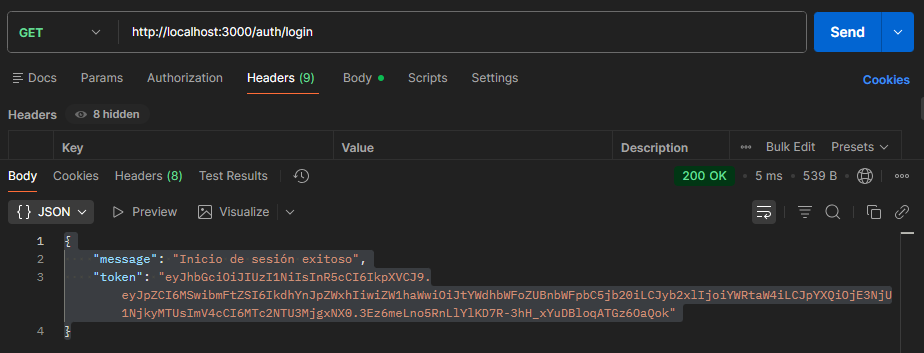
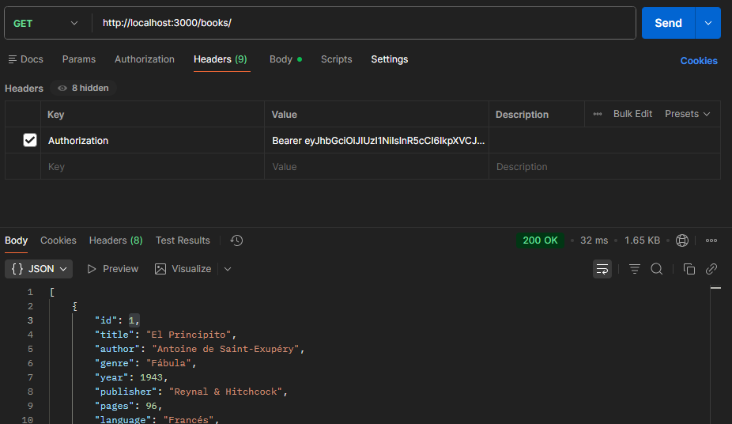

<div align="center">
  
</div>

<h2 align="center">
📚 Proyecto Books API 📚 <br>
 -- Autenticación con JWT -- <br>
<span style="font-size:1.2rem; font-weight:bold;">Back End</span> </h2>

---

# 📑 Índice
- [📑 Índice](#-índice)
  - [📌 Descripción](#-descripción)
  - [🧰 Tecnologías utilizadas](#-tecnologías-utilizadas)
  - [📁 Estructura del proyecto](#-estructura-del-proyecto)
  - [🧩 Decisión de arquitectura (sin carpeta `models`)](#-decisión-de-arquitectura-sin-carpeta-models)
  - [🔧 Instalación y ejecución](#-instalación-y-ejecución)
    - [1️⃣ Clonar repositorio](#1️⃣-clonar-repositorio)
    - [2️⃣ Instalar dependencias](#2️⃣-instalar-dependencias)
    - [3️⃣ Crear archivo `.env`](#3️⃣-crear-archivo-env)
    - [4️⃣ Iniciar servidor](#4️⃣-iniciar-servidor)
  - [📚 Descripción de funcionalidades](#-descripción-de-funcionalidades)
    - [✔ 1. CRUD de libros](#-1-crud-de-libros)
    - [✔ 2. Filtrado avanzado por autor](#-2-filtrado-avanzado-por-autor)
    - [✔ 3. Validación de duplicados](#-3-validación-de-duplicados)
    - [✔ 4. Middlewares](#-4-middlewares)
  - [📚 Endpoints](#-endpoints)
    - [Obtener token](#obtener-token)
    - [Obtener todos los libros](#obtener-todos-los-libros)
    - [Filtrar por autor](#filtrar-por-autor)
    - [Crear libro](#crear-libro)
  - [🛡 Autenticación JWT](#-autenticación-jwt)
  - [🛑 Manejo de errores](#-manejo-de-errores)
  - [🙋‍♀️ Autora](#️-autora)
  - [📝 Licencia](#-licencia)

---

## 📌 Descripción  
API REST desarrollada con Node.js, Express, TypeScript y CORS, que permite gestionar un catálogo de libros mediante endpoints protegidos con **autenticación JWT**.  
Para obtener el token, se debe realizar:

```
GET http://localhost:3000/author/login
```
<p align="center">
  
  <br>
  <sub>Nos devuelve un token</sub>
</p>

<p align="center">
  
  <br>
  <sub>Authorization Bearer token, para realizar los CRUD</sub>
</p>

Este endpoint devuelve un JWT que deberá enviarse en todas las solicitudes protegidas.

<a href="#-índice">⬆️ Volver al índice</a>

---

## 🧰 Tecnologías utilizadas

 **Node.js + Express**  

 **TypeScript**  

 **CORS**  

 **JSON Web Token (JWT)** 

 **File System (books.json)**  

 **Middlewares personalizados**

<a href="#-índice">⬆️ Volver al índice</a>

--- 
## 📁 Estructura del proyecto

    books-api-jwt/
    ├── 📂src/
    │   ├── 📂controllers/
    │   │   └── bookController.ts    
    │   ├── 📂middlewares/
    │   │   ├── logger.ts
    │   │   ├── authJWT.ts
    │   │   └── errHandler.ts
    │   ├── 📂routes/
    │   │   ├── booksRoutes.ts
    │   │   └── authRoutes.ts
    │   ├── 📂types/
    │   │   └── book.ts
    │   ├── 📂database/
    │   │   └── books.json
    │   └── index.ts
    ├── .env
    ├── package.json
    ├── tsconfig.json
    └── README.md

<a href="#-índice">⬆️ Volver al índice</a>

-----------------------------------------------------------------------

## 🧩 Decisión de arquitectura (sin carpeta `models`)

En este proyecto **no se utiliza la carpeta `models`** ya que la API trabaja con una base de datos local en formato **JSON** utilizando **File System (fs)**.

La estructura y tipado de los datos se define en la carpeta:

📂 `types/`

```ts
export interface Book {
  id: number;
  title: string;
  author: string;
  year: number;
  // ...
}
```
<a href="#-índice">⬆️ Volver al índice</a>

---

## 🔧 Instalación y ejecución

### 1️⃣ Clonar repositorio
```bash
git clone https://github.com/magamahe/books-api-jwt.git
cd books-api-jwt
```

### 2️⃣ Instalar dependencias
```bash
npm install
```

### 3️⃣ Crear archivo `.env`
```env
PORT=3000
```

### 4️⃣ Iniciar servidor
```bash
npm run dev
```

Servidor en:  
```
http://localhost:3000
```
<a href="#-índice">⬆️ Volver al índice</a>

---

## 📚 Descripción de funcionalidades

### ✔ 1. CRUD de libros  
Incluye:
- GET /books  
- GET /books?author=nombre  
- GET /books/:id  
- POST /books  
- PUT /books/:id  
- DELETE /books/:id  

Todos los registros se guardan en `/src/database/books.json`.

### ✔ 2. Filtrado avanzado por autor
| Búsqueda | Resultado |
|----------|-----------|
| author=jose | libros que contengan "jose" |
| author=Jose%20Martinez | coincidencia exacta |

### ✔ 3. Validación de duplicados  
El endpoint POST verifica que **título + autor** no exista ya en la base.

### ✔ 4. Middlewares  
- Logger → muestra cada request  
- Auth → verifica JWT  
- Handler → errores globales  

<a href="#-índice">⬆️ Volver al índice</a>

---

## 📚 Endpoints

### Obtener token
```
GET /author/login
```

### Obtener todos los libros
```
GET /books
Authorization: Bearer {TOKEN}
```

### Filtrar por autor
```
GET /books?author=nombre
Authorization: Bearer {TOKEN}
```

### Crear libro  
```json
{
  "title": "Ultima prueba con JWT",
  "author": "Herrero Jose",
  "genre": "Aprendiz",
  "year": 2025,
  "publisher": "Ada Editorial",
  "pages": 250,
  "language": "Español",
  "isbn": "978-0000000003",
  "available": true
}
```
<a href="#-índice">⬆️ Volver al índice</a>

---

## 🛡 Autenticación JWT

Middleware:
```ts
const token = req.headers.authorization?.split(" ")[1];
const decoded = jwt.verify(token, process.env.JWT_SECRET);
```

Si es inválido:  
```
401 Unauthorized
```

<a href="#-índice">⬆️ Volver al índice</a>

---

## 🛑 Manejo de errores  
Middleware global que captura excepciones y retorna:
```json
{ "error": "Error interno del servidor" }
```

<a href="#-índice">⬆️ Volver al índice</a>

---

## 🙋‍♀️ Autora

<p align="rigth"> <strong>MARTINEZ HERRERO, Maria Gabriela</strong> 
</p> <p align="center"> <a href="https://github.com/magamahe" target="_blank">  </a> &nbsp;&nbsp; <a href="https://linkedin.com/in/magamahe" target="_blank">  </a> &nbsp;&nbsp; <a href="https://discord.com/users/1143961509505019904" target="_blank">  </a> &nbsp;&nbsp; <a href="mailto:magamahe@gmail.com">  </a> </p>

------------------------------------------------------------------------

## 📝 Licencia

MIT License.

