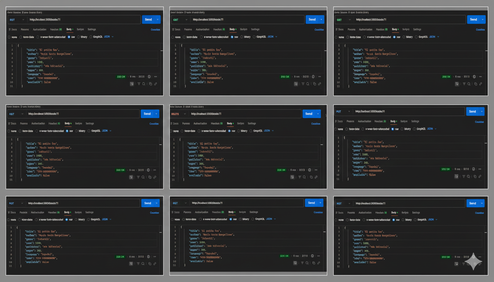

<div align="center">
  
</div>


<h2 align="center">
📚 Proyecto Books API 📚 <br>
 -- Autenticación con Token (ENV) -- <br>
<span style="font-size:1.2rem; font-weight:bold;">Back End</span> </h2>


---------------
# 📑 Índice

- [📑 Índice](#-índice)
  - [📌 Descripción](#-descripción)
  - [🧰 Tecnologías utilizadas](#-tecnologías-utilizadas)
  - [📁 Estructura del proyecto](#-estructura-del-proyecto)
  - [🧩 Decisión de arquitectura (sin carpeta `models`)](#-decisión-de-arquitectura-sin-carpeta-models)
  - [🔧 Instalación y ejecución](#-instalación-y-ejecución)
    - [1️⃣ Clonar el repositorio](#1️⃣-clonar-el-repositorio)
    - [2️⃣ Instalar dependencias](#2️⃣-instalar-dependencias)
    - [Dependencias principales:](#dependencias-principales)
    - [3️⃣ Crear archivo .envo `.env`](#3️⃣-crear-archivo-envo-env)
    - [4️⃣ Iniciar servidor](#4️⃣-iniciar-servidor)
  - [📚 Descripción de funcionalidades](#-descripción-de-funcionalidades)
    - [✔️ 1. CRUD completo de libros](#️-1-crud-completo-de-libros)
      - [(`GET`, `POST`, `PUT`, `DELETE`)](#get-post-put-delete)
  - [](#)
    - [✔️ 2. Filtrado avanzado por autor](#️-2-filtrado-avanzado-por-autor)
    - [✔️ 3. Validación de duplicados](#️-3-validación-de-duplicados)
    - [✔️ 4. Middlewares usados](#️-4-middlewares-usados)
      - [🔹 Middleware de logs (logger.ts)](#-middleware-de-logs-loggerts)
      - [🔹 Middleware de autenticación (auth.ts)](#-middleware-de-autenticación-authts)
      - [🔹 Middleware global de errores (errHandler.ts)](#-middleware-global-de-errores-errhandlerts)
  - [📚 Endpoints](#-endpoints)
    - [Obtener todos los libros](#obtener-todos-los-libros)
    - [Filtrar por autor](#filtrar-por-autor)
    - [Obtener libro por ID](#obtener-libro-por-id)
    - [Crear libro](#crear-libro)
  - [🛡 Autenticación por Token](#-autenticación-por-token)
  - [🛑 Manejo de Errores](#-manejo-de-errores)
  - [🙋‍♀️ Autora](#️-autora)
  - [📝 Licencia](#-licencia)

-------------- 

## 📌 Descripción
API REST desarrollada con Node.js, Express, TypeScript y CORS, que permite gestionar un catálogo de libros mediante endpoints protegidos con autenticación por token.

Esta versión de la API utiliza **autenticación por Token simple**, enviado mediante el header `Authorization`.

<a href="#-índice">⬆️ Volver al índice</a>

------------------------------------------------------------------------

## 🧰 Tecnologías utilizadas

🟩 **Node.js** + **Express** — Servidor y manejo de rutas REST

🔷 **TypeScript** — Tipado estático y desarrollo más seguro

🌐 **CORS** — Permite solicitudes desde otros orígenes

🔑 **Token** — Autenticación por encabezado personalizado

📁 **File System** (fs) — Base de datos local usando books.json

🧩 **Middlewares personalizados** — Logger, Auth y manejo de errores


<a href="#-índice">⬆️ Volver al índice</a>

--------------------------------------

## 📁 Estructura del proyecto

    books-api-token/
    ├── 📂src/
    │   ├── 📂controllers/
    │   │   └── authController.ts
    │   │   └── bookController.ts    
    │   ├── 📂middlewares/
    │   │   ├── logger.ts
    │   │   ├── auth.ts
    │   │   └── errHandler.ts
    │   ├── 📂routes/
    │   │   ├── booksRoutes.ts
    │   │   └── authRoutes.ts
    │   ├── 📂types/
    │   │   └── book.ts
    │   ├── 📂utils/
    │   │   └── db.ts
    │   ├── 📂database/
    │   │   └── books.json
    │   └── index.ts
    ├── .env
    ├── package.json
    ├── tsconfig.json
    └── README.md

<a href="#-índice">⬆️ Volver al índice</a>


-----------------------------------------------------------------------

## 🧩 Decisión de arquitectura (sin carpeta `models`)

En este proyecto **no se utiliza la carpeta `models`** ya que la API trabaja con una base de datos local en formato **JSON** utilizando **File System (fs)**.

La estructura y tipado de los datos se define en la carpeta:

📂 `types/`

```ts
export interface Book {
  id: number;
  title: string;
  author: string;
  year: number;
  // ...
}
```

<a href="#-índice">⬆️ Volver al índice</a>

-----------------------------------------------------------------------
## 🔧 Instalación y ejecución

### 1️⃣ Clonar el repositorio

``` bash
git clone https://github.com/magamahe/books-api.git
cd books-api-token
```
-----------------------------------------------------------------------

### 2️⃣ Instalar dependencias
``` bash
npm install
```

### Dependencias principales:

- express
- typescript 
- cors
- ts-node y/o alternativa ts-node-dev
- @types para todas las librerías

### 3️⃣ Crear archivo .envo `.env`

``` bash
    PORT=3000
    TOKEN=XXXXXX
```

El Token debe enviarse en cada request:

    Authorization: XXXXXX

-----------------------
### 4️⃣ Iniciar servidor

``` bash
    npm run dev
``` 

Servidor corriendo en:

``` bash
    http://localhost:3000
``` 

<a href="#-índice">⬆️ Volver al índice</a>

-------------------------------------------------

## 📚 Descripción de funcionalidades
### ✔️ 1. CRUD completo de libros

####   (`GET`, `POST`, `PUT`, `DELETE`)
  
La API permite:
    - GET /books → Obtener todos los libros
    - GET /books?author=nombre → Filtrar por autor
    - GET /books/:id → Obtener un libro por ID
    - POST /books → Crear un libro
    - PUT /books/:id → Editar un libro
    - DELETE /books/:id → Eliminar un libro

Todos los libros se guardan en src/dabase/books.json.

<div align="center">
  
</div>
------------------------------------------------------------------------
### ✔️ 2. Filtrado avanzado por autor

El endpoint permite:

| Búsqueda | Resultado |
|----------|-----------|
| author=jose | trae todos los libros que contengan jose |
| author=Jose%20Martinez | coincidencia exacta |


Funciona sin importar mayúsculas/minúsculas.

---------------------
### ✔️ 3. Validación de duplicados

El endpoint POST /books NO permite agregar un libro cuyo título y autor coincidan con otro existente.

Retorna:
``` bash
{
  "error": "El libro ya existe"
}
``` 

---------
### ✔️ 4. Middlewares usados

#### 🔹 Middleware de logs (logger.ts)

Registra cada request:
``` bash
[LOG] Solicitud recibida: GET /books
```

#### 🔹 Middleware de autenticación (auth.ts)

Requiere que el cliente envíe un token en Headers:

``` bash
Authorization: 123456
```

Si falta o es incorrecto → 401.


#### 🔹 Middleware global de errores (errHandler.ts)

Captura errores inesperados y responde:
``` bash
{
  "error": "Error interno del servidor"
}
```

<a href="#-índice">⬆️ Volver al índice</a>

---------------------------------------------------


## 📚 Endpoints

### Obtener todos los libros

    GET /books
    Authorization: {TOKEN}

### Filtrar por autor

    GET /books?author=nombre
    Authorization: {TOKEN}

### Obtener libro por ID

    GET /books/:id
    Authorization: {TOKEN}

### Crear libro

    POST /books
    Content-Type: application/json
    Authorization: {TOKEN}

Body:

``` json
{
  {
    "title": "Ultima prueba con token",
    "author": "Herrero Jose",
    "genre": "Aprendiz",
    "year": 2025,
    "publisher": "Ada Editorial",
    "pages": 250,
    "language": "Español",
    "isbn": "978-0000000003",
    "available": false
}
```

<a href="#-índice">⬆️ Volver al índice</a>

------------------------------------------------------------------------

## 🛡 Autenticación por Token

El middleware valida:

``` js
const token = req.headers["authorization"];
if (token === process.env.TOKEN) next();
else return res.status(401).json({ error: "Token inválido o ausente" });
```

------------------------------------------------------------------------

## 🛑 Manejo de Errores

Cualquier error pasa por un middleware global.

------------------------------------------------------------------------

## 🙋‍♀️ Autora

<p align="rigth"> <strong>MARTINEZ HERRERO, Maria Gabriela</strong> 
</p> <p align="center"> <a href="https://github.com/magamahe" target="_blank">  </a> &nbsp;&nbsp; <a href="https://linkedin.com/in/magamahe" target="_blank">  </a> &nbsp;&nbsp; <a href="https://discord.com/users/1143961509505019904" target="_blank">  </a> &nbsp;&nbsp; <a href="mailto:magamahe@gmail.com">  </a> </p>

------------------------------------------------------------------------

## 📝 Licencia

MIT License.

